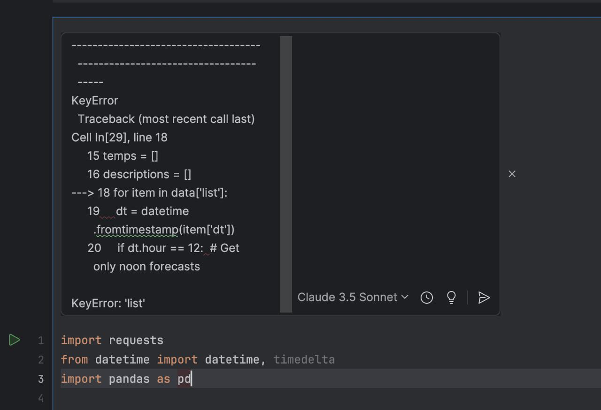
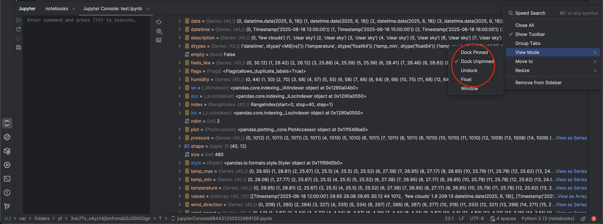
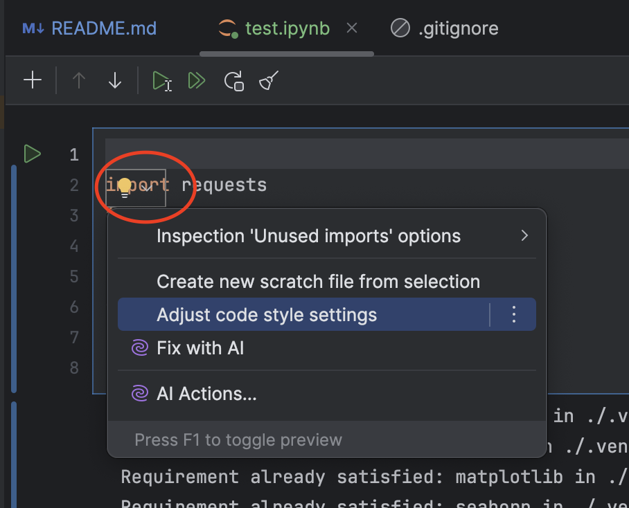

# Notebooks

_Build #PY-253.241, built on June 18, 2025_

## Works well
- Built-in functions for splitting, moving, and merging cells.
  - with basic shortcuts (using on cell themselves) cmd+c cmd+x cmd+v
- Variable viewer.
- Display of console output for each cell (graphs/text).
- Agent can create cells.
- Applying code to files from the side chat (currently in beta testing).
- Model switching.
- Running individual and all cells.

Asked the assistant to create a weather data parser; it handled the data processing logic very well.

## Issues

### Assistant
- The assistant did not manage to create a proper query, but that is likely a model issue.
- The assistant has trouble understanding requests to delete code cells or clear a file.

#### Suggestions
- It would be nice if you could select "delete unused elements" in suggestions, because LLMs often generate something that is not used at all.
- Not sure if it's by design, but the suggestions window moves independently of the prompt line position, [video](https://drive.google.com/file/d/1jxGtaqg270cnRgipSp9tX_PuqOiiacRZ/view?usp=drive_link)

### Incell Prompt Line
- The prompt input field is inconvenient. It doesn’t adapt well to the input size. Sometimes it doesn’t resize, only shows what fits in a small single line, sometimes resizes with delays. A lot of unused space appears with large prompts, [video](https://drive.google.com/file/d/1w17Jl2o6oMfgpaUPPHF2zjzycmmomlPr/view?usp=drive_link).
- If you click another incell prompt line trigger, the previous prompt gets deleted (which is annoying, as you have to rewrite your prompt), and a new empty incell opens, [video](https://drive.google.com/file/d/1VZ2qp06pzdJVEj83R_bpmGfbh-RzkkGq/view?usp=drive_link).
- Update as of yesterday: the side scrollbar that appeared when inserting a large text into the prompt line was removed.

_The weather request was written by Sonnet 4 model._

- When querying o1, the time from sending the request to the response is noticeably longer than with other models (maybe a model feature, [video](https://drive.google.com/file/d/1Qpns1vv2QAm9ZX7R1asU2nTJxuWiQcCv/view?usp=drive_link))

## Side issues
- When clicking on the header of the terminal window (or any other dock) in window mode, it does not expand to fullscreen, but I would really like it, [video](https://drive.google.com/file/d/1Qpns1vv2QAm9ZX7R1asU2nTJxuWiQcCv/view?usp=drive_link).
- Did not notice any difference in behavior between these 4 view modes:

- Need to reconsider the lightbulb button placement. It appears at random times (just when you don’t expect it).

## Didn’t to check
- Debug
- Customization