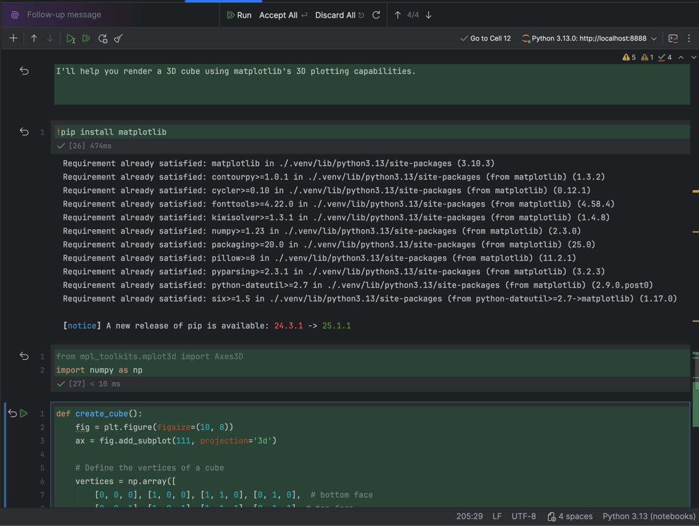
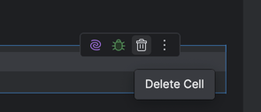
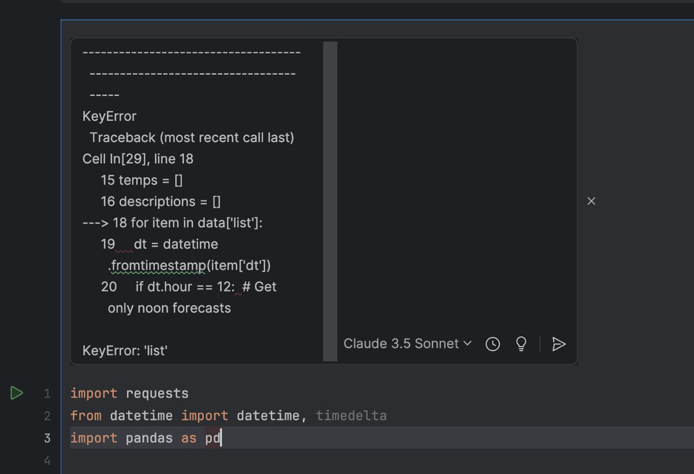
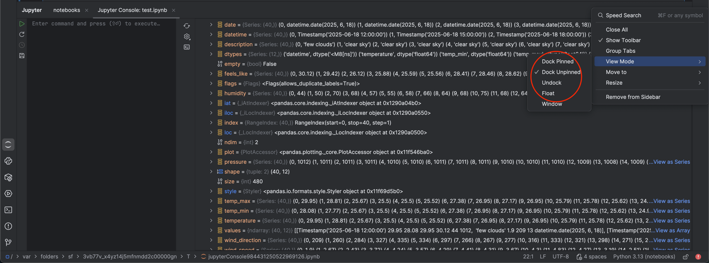
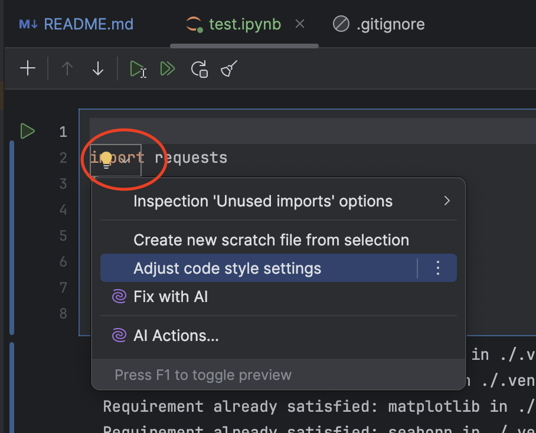

# Notebooks

_Build #PY-253.241, built on June 18, 2025_

## Нормально работает
- встроенные функции разделение, перемещение, объединение ячеек.
- просмотр переменных
- отображение выводов консоли каждой ячейки (графики/текст)
- создание клеток агентом
- применение кода в файлы из бокового чата (которое под бета тестированием)
- переключение моделей
- запуск (отдельных и всех) ячеек

Запросил у ассистента создать парсер данных о погоде, с логикой обрабокти данных он справился отлично

## Проблемы

### Assistant
- ассистент не справился составлением правильного запроса, но это скорее проблемы модели.
- Ассистент плохо понимает, когда просишь удалить блоки кода или отчистить файл.
- Нет никаких хинтов для вывода с терминала.
- Хотелось чтобы после окончания написания кода промптом можно было бы удалить конкретные ячейки по кнопке **до принятия кода**. После завершения исполнения промпта новый код подствечивается зелёным и проще заметить лишние нагенерированные ячейки (как в этом примере блоки с библиотекой и md ячейка) и удалить их. А так приходится принимать всё и после этого уже удалить лишнюю

- Запрашивайте сущность больше чем заложено в лимит, хотя запрос короткий [видео](https://drive.google.com/file/d/1Zppel57P6cVySVl5bJukSQ25e0zRA7Q5/view?usp=sharing).

#### Suggestions
- Хотелось бы чтобы в suggestions можно было выбрать "удалить неспользуемые элементы", потому что ллм часто может сгенерировать что-то что не используется никак.
- Не знаю задумано ли так, но suggestions это окно и оно двигается вне завимимости от положения prompt line, [видео](https://drive.google.com/file/d/1jxGtaqg270cnRgipSp9tX_PuqOiiacRZ/view?usp=drive_link)

### Incell Prompt Line
- Напрягает как работает поле для ввода промптов. Оно плохо адаптируется под размеры введённого текста. Может не адаптироваться, выводит только то сколько помещается на маленькой одной строке, может адаптироваться с задержками. очень много неиспользуемого места образуется при больших промптах, [видео](https://drive.google.com/file/d/1w17Jl2o6oMfgpaUPPHF2zjzycmmomlPr/view?usp=drive_link).
- Если нажать на другую кнопку вызова строки incell промпта, старый весь промпт старый удаляется (что неприятно мне кажется, бесит когда заного нужно писать промпт), и открывается чистое incell, [видео](https://drive.google.com/file/d/1VZ2qp06pzdJVEj83R_bpmGfbh-RzkkGq/view?usp=drive_link).
- upd. co вчера, убрали боковой ползунок появляющийся при попытке вставить большой текст в prompt-line

_Запрос с погодой писался на Sonnet 4._

- Когда делаю запрос к o1 процесс от отправки запроса до ответа заметно дольше чем другие модели (быть может это особенность модели, [видео](https://drive.google.com/file/d/1Qpns1vv2QAm9ZX7R1asU2nTJxuWiQcCv/view?usp=drive_link))

### Creating a process in a new window
- Программы в созданном окне не завершаются коректно [видео](https://drive.google.com/file/d/1Z4tAk99mAGHJ8Mq7auvVBF-hidwNrG19/view?usp=drive_link), видео . 
  - Также всё нормально работает, когда просто запускаю через консоль в IDE файл .py [видео](https://drive.google.com/file/d/1VJz2sJVZPojUuGbhzPL-KztwYq36orR7/view?usp=sharing). Это именно проблема ноутбуков.

### Cursor positioning
- при об[видео](https://drive.google.com/file/d/1JlnbkcXLdvkhZNUDxG69m86t77S9zYTg/view?usp=sharing)

## Side issues
- При нажатии на заголововк окна терминала (или любого другого дока) в window mode он не раскрывается на весь экран, а очень хотелось бы, [видео](https://drive.google.com/file/d/1Qpns1vv2QAm9ZX7R1asU2nTJxuWiQcCv/view?usp=drive_link).
- Не заметил никакой разницы в поведении вот этих 4 режимах просмотров

- надо подумать про расположение кнопки с лампочкой. Она появляется в случайный момент (когда её совсем не ожидаешь)

## Не успел посмотреть
- дебаг
- кастомизация